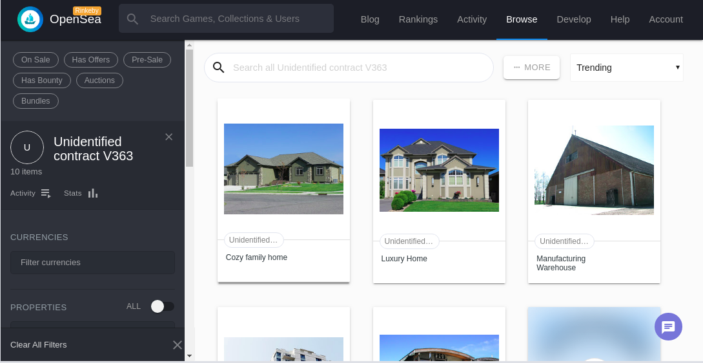

# Udacity Blockchain Capstone

The capstone will build upon the knowledge you have gained in the course in order to build a decentralized housing product. 

## Getting Started

### Prequisites
For development make sure ganache-cli is installed globally,metamask extension is enabled and solidity compiler is configured in truffle config.

### Install Dependencies
* Install all requisite npm packages
```
npm install
```
#### Dependencies Version
* Truffle v5.1.23 (core: 5.1.23)
* Solidity v0.5.16 (solc-js)
* Node v8.11.2
* Web3.js v1.2.1
* Oppenzepplin-solidity 2.2.0
* Truffle-hdwallet-provider 1.0.17
* npm 5.6.x

### ZoKrates Setup

 The following instructions explain how to generate addtional proofs for tokenIds.

* Step 1: Run Docker
  ```
    sudo systemctl start docker
  ```

* Step 2: Run ZoKrates
  ```
  docker run -v `pwd`/zokrates/code/:/home/zokrates/code -ti zokrates/zokrates /bin/bash
  ```

  Change into the square directory
  ``` 
  cd code/square/
  ``` 

* Step 3: Compile the program written in ZoKrates DSL
  ``` 
  ~/zokrates compile -i square.code
  ``` 

* Step 4: Generate the trusted setup
  ``` 
  ~/zokrates setup -s GM17
  ```

* Step 5: Compute witness
  ``` 
  ~/zokrates compute-witness -a 3 9
  ```

* Step 6: Generate proof
  ```
  ~/zokrates generate-proof -s GM17 -j <path to proof file>
  ```

* Step 7: Export verifier
  ```  
  ~/zokrates export-verifier -s GM17
  ```
Re-run steps 5 and 6 with different arguments, e.g. 2 4, to generate additional proofs for minting tokens.

### Development environment
* Run ganache:
```
ganache-cli
```
* In another terminal window:
```
cd eth-contracts
```
* Compile the contracts:
```
truffle compile
```

* This will create the smart contract artifacts in folder ```build/contracts```.

* Migrate smart contracts to the locally running blockchain, ganache-cli:

```
truffle migrate
```

* Test the smart contracts:

```
truffle test
```

All tests should pass successfully

### Deploy on Rinkeby
* Add .secret file containing metamask passphrase at the root of directory.
* Add your infura API key in .infuraKey file at the root of the directory.
* Update truffle config in the ```networks``` to contain configurations for rinkeby network
```
     rinkeby: {
      provider: () => new HDWalletProvider(mnemonic, `https://rinkeby.infura.io/v3/${infuraKey}`),
      network_id: 4,       // Rinkeby's id
      gas: 4612388,        // Rinkeby has a lower block limit than mainnet
      gasPrice: 10000000000,
      skipDryRun: true     // Skip dry run before migrations? (default: false for public nets )
    },
```

* Run and deploy on rinkeby
``` 
cd eth-contracts 
```
```
truffle migrate --network rinkeby --reset --compile-all
```
* Contract address is witten to `config.json`

Note: Included library BN256G2 as Verifier.sol was throwing unresolved error, which got resolved by deploying the library first and linking it.

### Mint Tokens
* Inside ```eth-contracts folder```, Run
```
node addSolution.js ../zokrates/code/square/proofs/proof<number>.json <tokenId>
```

```
node mintToken.js <tokenId>
```

### OpenSea MarketPlace
* Get your contract listed on https://rinkeby.opensea.io/get-listed/step-two

## Project Deliverables
* View the contracts on etherscan 
    * Verifier at 0x19D2a70a5432327339b5A02F5163e2876006959F
    * SolnSquareVerifier at 0x23da8c49bC8fDF53dEEC256162F00198D5AcC399
* OpenSea Market Place - https://rinkeby.opensea.io/assets/unidentified-contract-v363



# Project Resources

* [Remix - Solidity IDE](https://remix.ethereum.org/)
* [Visual Studio Code](https://code.visualstudio.com/)
* [Truffle Framework](https://truffleframework.com/)
* [Ganache - One Click Blockchain](https://truffleframework.com/ganache)
* [Open Zeppelin ](https://openzeppelin.org/)
* [Interactive zero knowledge 3-colorability demonstration](http://web.mit.edu/~ezyang/Public/graph/svg.html)
* [Docker](https://docs.docker.com/install/)
* [ZoKrates](https://github.com/Zokrates/ZoKrates)
